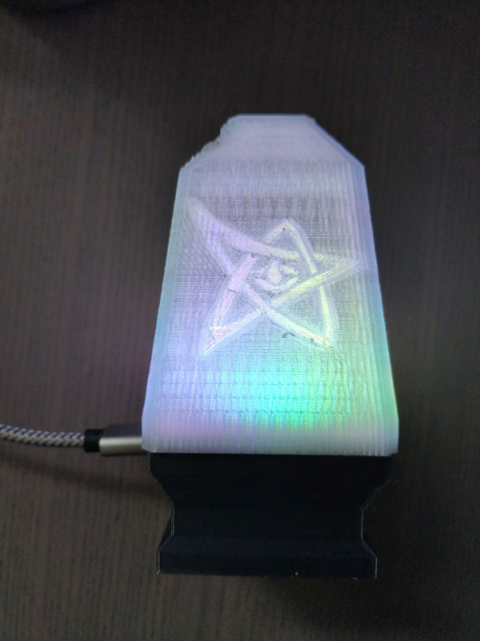
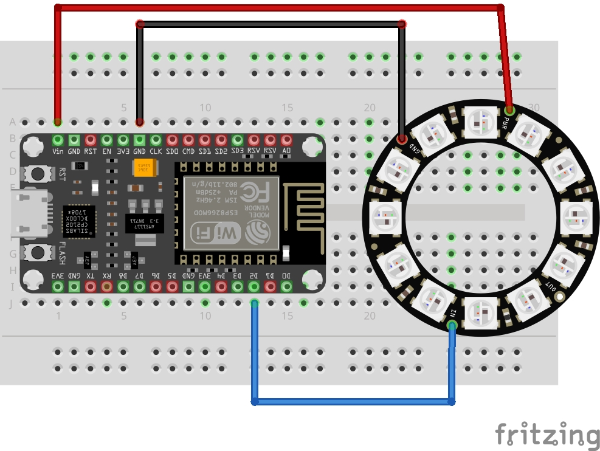
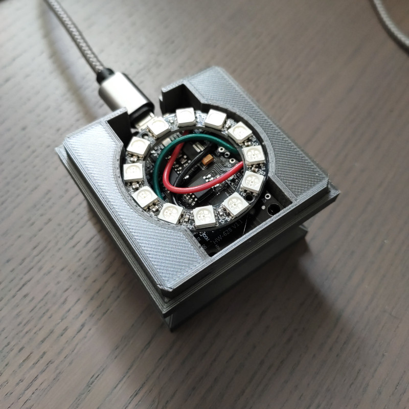

# ESP8266.ESPHomeLight

New Version of the ESP8266.MQTTLight. Same hardware, but new ESPHome based software

## Whats this?

I wanted some sort of RGB light to signal all sort of things: New emails, high server load... stuff like that. So looked through the electronics stuff I had flying around to see what I can use for this kind of job.

## Components

### Electronics

- A old ESP8266 board. More than enough for that simple task
- A Adafruit NeoPixel Ring with 12 LEDs

I also had a few unused ESP-01S, but they need 3,3V and I would have needed a converter from 5V to 3.3V plus a USB converter for programming. The "big" ESP8266 Devkit has integrated USB, making SW development and flashing easier and also powers everything over USB. Plus the wiring is much simpler, the LED ring can be directly wired to the ESP without any additional components. Even a PCB is unnecessary.

### Mechanics

Based on [dutchmoguls Elder Sign Nightlight](https://www.thingiverse.com/thing:921962).

I redesigned the base to accommodate the ESP and the LED ring

ZP

## Software

Created with ESPHome, actually not much to say about it. With web server enabled, HomeAssistant integration and a few effects
